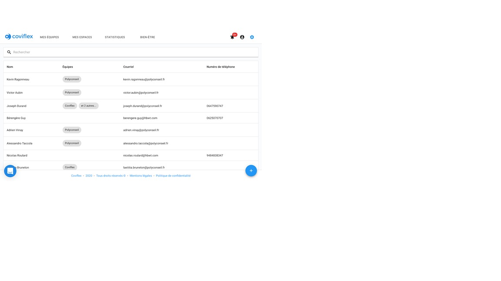
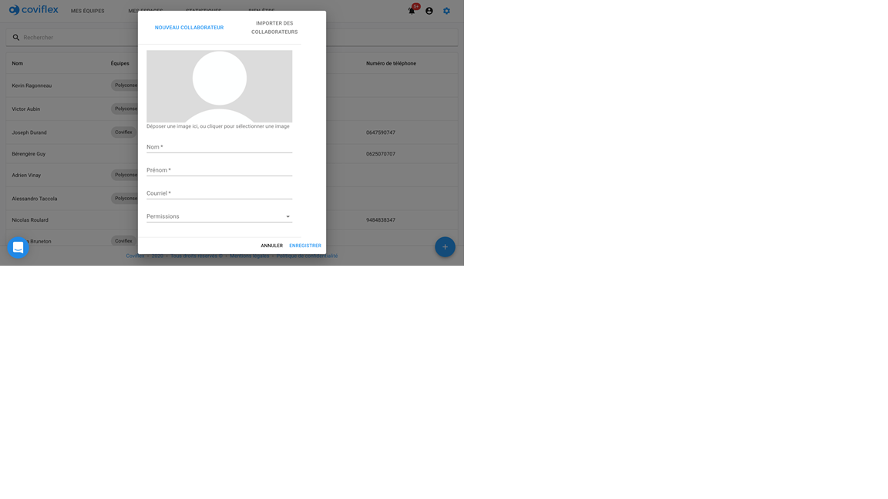
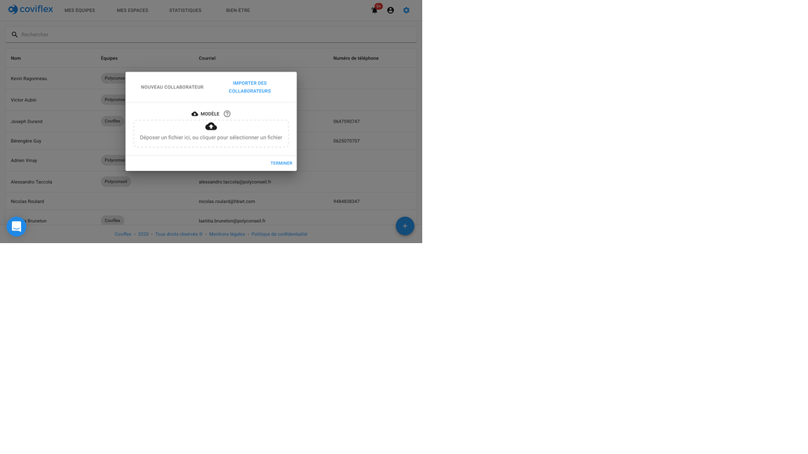
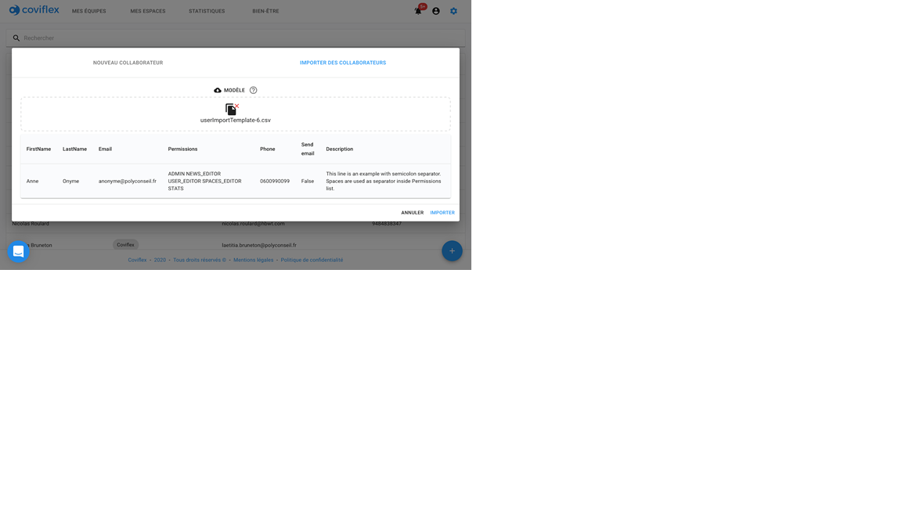
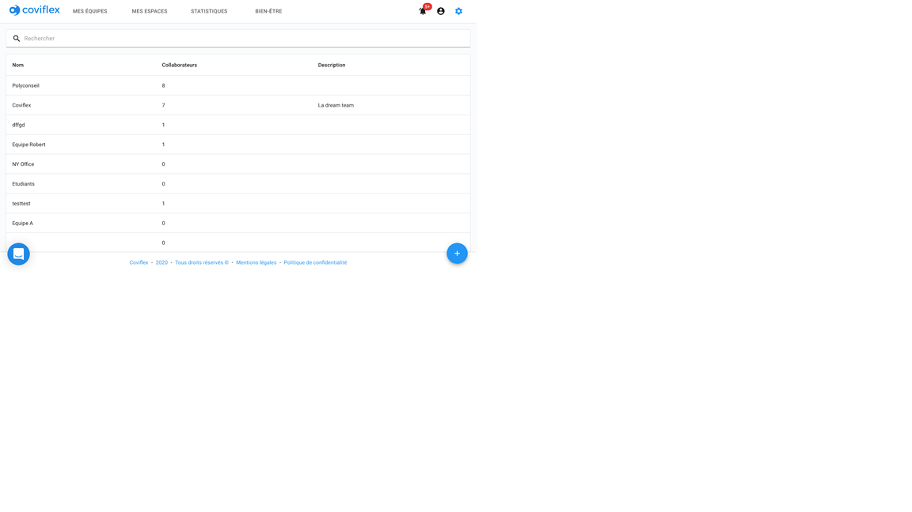

Ajouter un collaborateur
=============================================
Espace d’ajout.
********************
| Les collaborateurs sont les profils utilisateurs qui sont au coeur de l’outil. Ils réservent leurs places dans les bureaux et indiquent leur situation d’absence ou de télétravail.

| Pour ajouter un utilisateur, l'administrateur dispose d’un bouton bleu en bas à droite de la liste d'utilisateurs, dans la roue dentée de la barre de navigation.

En cliquant sur ce bouton, une fenêtre pop up s’ouvre.

Deux modes sont possibles pour ajouter un utilisateur.
     | * Le mode individuel (onglet “Nouvel utilisateur”)
     | * L’import en batch, qui permet d’ajouter un grand nombre d’utilisateur à la fois (onglet “Importer des utilisateurs”)

Création individuelle.
***********************************************
Pour ajouter un utilisateur de façon individuelle, renseignez les informations de l’utilisateur dans l’onglet correspondant:

    * son nom/prénom

    * son courriel

    * une ou des permissions cumulables (simple collaborateur par défaut)

Il peut aussi ajouter:

    * un numéro de téléphone,

    * une photo

    * une description

Une checkbox permet aussi d’avertir l’utilisateur en question de la création de son compte par email.

Les permissions permettent à l’utilisateur de :

     * Créer/modifier/supprimer des billets d’information

     * Créer/modifier/supprimer des espaces

     * Créer/modifier/supprimer des utilisateurs

     * Consulter les statistiques

     * Créer/modifier/supprimer les permissions elles-mêmes

La création d’un compte utilisateur se finalise en appuyant sur le bouton “enregistrer” en bas à droite.

Importation par groupe
***********************************************
| L’import d’utilisateurs se fait à partir d’un fichier CSV contenant les mêmes informations que le formulaire (nom, prénom, courriel…). Cette synchronisation est plus rapide pour ajouter un groupe important de collaborateurs.

| Il suffit de glisser le fichier dans l’espace d’import ou de cliquer sur cet espace pour ouvrir l’explorateur de fichiers et sélectionner le fichier.

Les lignes contenant des erreurs ne seront pas importées. Une fois le fichier sélectionné et soumis dans Coviflex, un aperçu permet de prévisualiser les utilisateurs importés. L’importation peut être finalisée en cliquant sur “importer”.

Un template est  téléchargeable en cliquant sur “Modèle” dans la popup ci-dessus. Avec Excel, le fichier template CSV est le suivant :

Nota : Il est possible les colonnes soient concaténées avec votre éditeur de fichier CSV. Dans ce cas vous pouvez tout de même modifier le template en veillant à respecter le format (nom des colonnes et séparateurs de colonne)

Le format CSV, ou Comma-Separated Values, contient les colonnes suivantes et séparées ici par un point-virgule

     Firstname : le prénom

     Lastname : le nom

     Permissions : la permission à choisir parmi les options suivantes:

         “NEWS_EDITOR” pour que l’utilisateur puisse écrire/supprimer les billets,

         “SPACES_EDITOR” pour que l’utilisateur puisse créer/supprimer les espaces,

         “USER_EDITOR” pour que l’utilisateur puisse inscrire/supprimer les utilisateur comme on le fait en ce moment,

         “ADMIN” pour pouvoir modifier les droits de chacun,

         “STATS” pour pouvoir consulter les statistiques et les moods

         et enfin “” pour aucun droit (ne rien entrer).

         Les quatre premières options sont cumulables en les séparant juste d’un espace comme dans l’exemple template “ADMIN NEWS_EDITOR SPACES_EDITOR”

     Email : l’adresse mail

     Phone : le numéro de téléphone

     Send email : Le booléen “envoyer un mail d’information” (colonne ou il faut mettre “TRUE” ou “FALSE” selon si l’on souhaite que l’utilisateur soit informé ou pas de la création de son compte)

     Description : La description de l’utilisateur

Nota : Attention de bien respecter les noms des colonnes du fichier template sinon votre fichier ne sera pas lu.

