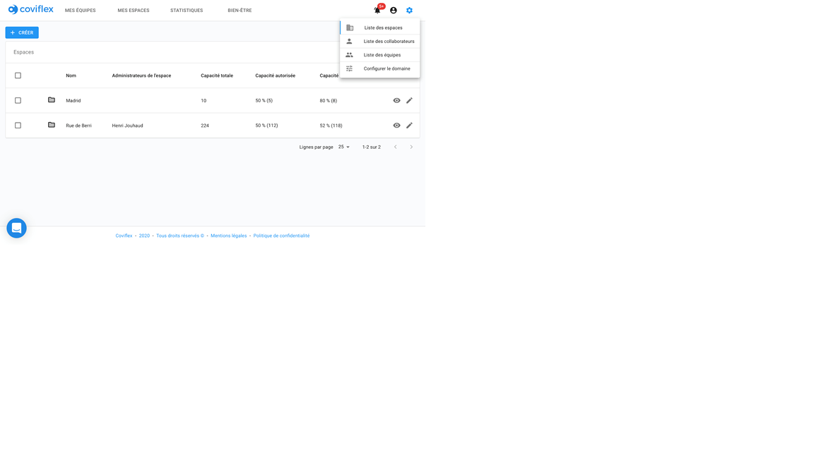
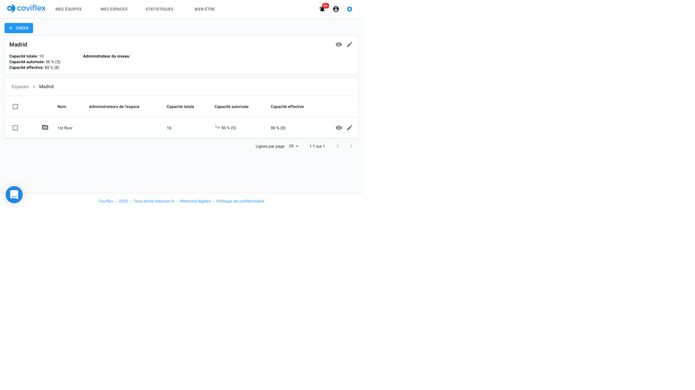
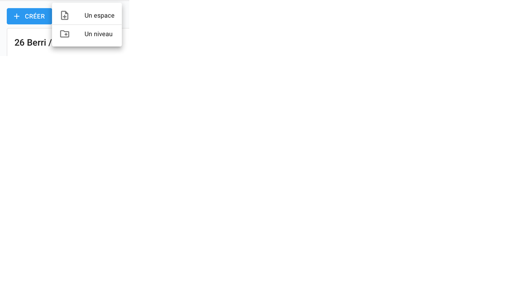
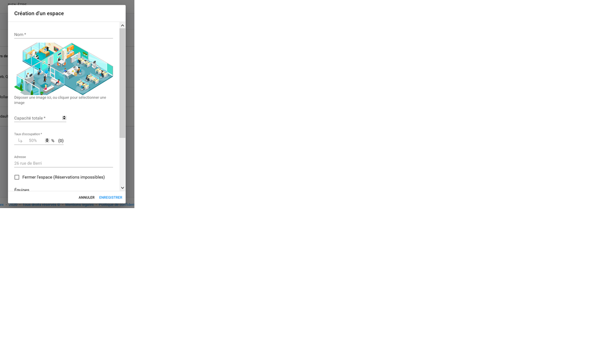
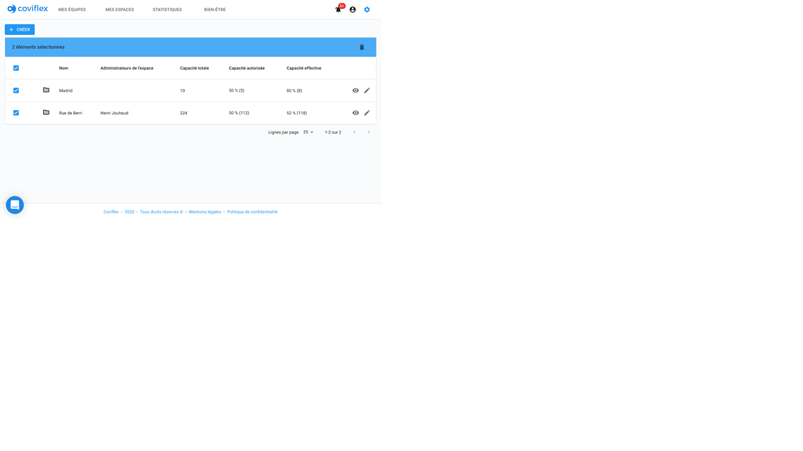
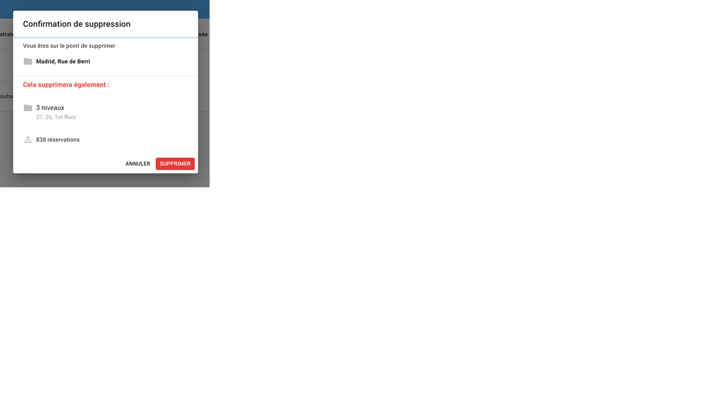
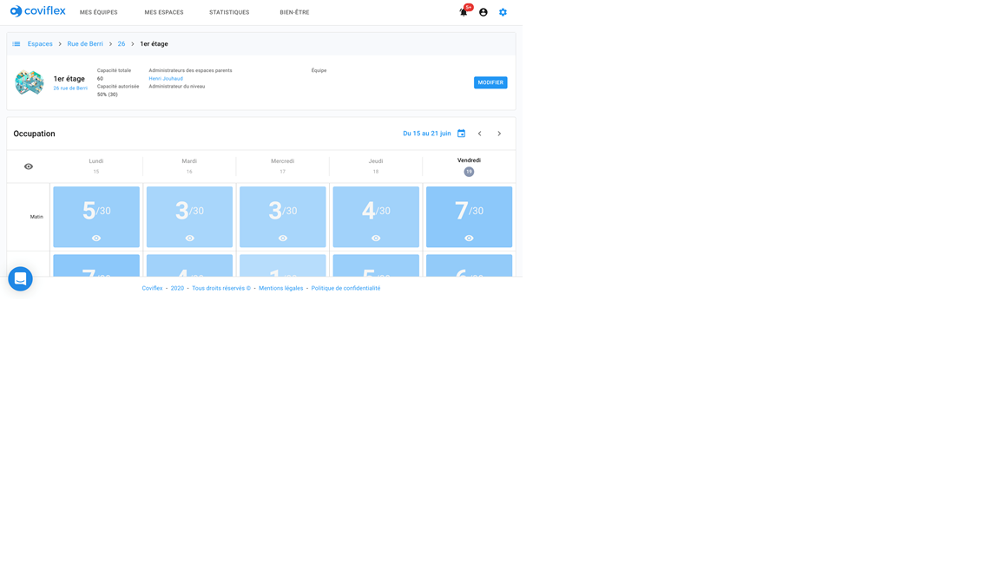
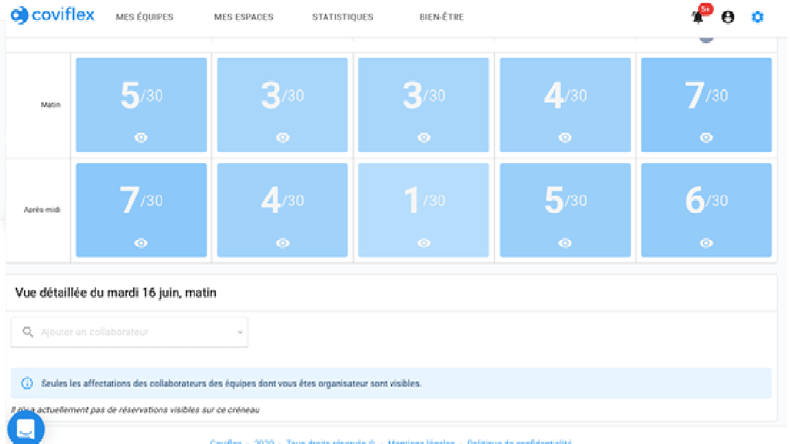

Ajouter un espace
=============================================

Espace d'ajout
****************************************
Finalement, vous pouvez aller dans l’onglet “espaces”. Le but de cet onglet est de pouvoir gérer les espaces de travail de votre organisation.

L'organisation des espaces est hiérarchisée. Vous disposez de deux types de représentation :

    ●	Les espaces d’un point de vue matériel: les salles où l’on trouve des places réservables pour s'asseoir et travailler. C’est le niveau le plus bas de la hiérarchie de votre organisation.

    ●	Les niveaux, qui sont des espaces au sens le plus large: un département, service, un étage, un bâtiment entier ou un campus. Les niveaux contiennent des espaces (et potentiellement des niveaux inférieurs) qui peuvent hériter de caractéristiques fixées sur leur niveau parent.

Ces deux représentations spatiales permettent de construire toute la hiérarchie spatiale ou organisationnelle de l’entreprise avec des nœuds parents et enfants.

À tout point de la hiérarchie (bâtiment, étage ou département par exemple) un bouton bleu “+ créer” est disponible en haut à gauche pour créer une nouvelle unité. En cliquant sur ce bouton, on peut créer un espace ou un niveau. Ce dernier sera alors créé au point où l’administrateur se situe dans la hiérarchie au moment de cliquer sur “Créer”.

Formulaire d’ajout de niveau
****************************************

Une fenêtre pop-up s’ouvre là aussi:

L’utilisateur renseigne :

    1.	Le nom du niveau

    2.	Un taux d'occupation servant d’objectif à transmettre aux éléments enfants,

    3.	L’adresse du niveau

    4.	Si le niveau est accessible ou non par les autres collaborateurs lors de sa création

    5.	Une ou plusieurs équipes associées à cet espace

    6.	Le(s) responsable(s) associé(s) au niveau

    7.	Si le niveau exclusif, c’est-à-dire réservé uniquement à l’équipe désignée pour y réserver ses places

**Note sur l'héritage des espaces :** Depuis son niveau parent le plus proche, un espace ou un niveau hérite automatiquement
des entités suivantes :

    ●	Le ou les responsables d’espace des niveaux supérieurs

    ●	La ou les équipes associées aux niveaux supérieurs

    ●	La photo du niveau supérieur

    ●	Le taux d’occupation autorisée du niveau supérieur

Formulaire d’ajout d’espace
****************************************

Une fenêtre pop-up s’ouvre, l'utilisateur doit renseigner :

    1.	Une image en la déposant ou en la sélectionnant dans ses fichiers

    2.	Un nom à l’espace

    3.	L’adresse de l’espace

    4.	Une capacité d'accueil et un taux d’occupation

    5.	Une équipe associée. Si une équipe est associée à un espace alors elle est prioritaire sur cet espace et l’espace devient dédié à cette équipe.

    6.	Un responsable associé. Il peut définir et gérer les attributs de l’espace. Il pourra assigner son espace à une équipe ou définir le taux d’occupation autorisé.

**Nota :** Le taux d’occupation hérité s’affiche en gris. Si le taux saisi est différent du taux hérité le champ devient orange avec un message vous l’indiquant. Vous pouvez enregistrer l’espace avec un taux d’occupation différent.

**Conséquence :** Le taux effectif (réel) d’occupation du niveau supérieur peut différer du taux d'occupation autorisé.

Le bouton modifier à côté des informations sur l’espace en haut de la page permet de modifier le formulaire de création en fournissant de nouvelles informations.

Supprimer un espace ou niveau
**************************************

Pour supprimer un espace ou niveau, il faut vous rendre dans la liste des espaces et sélectionner un ou plusieurs d’entre eux par leur check box à gauche de leur nom:

Un bandeau bleu apparaît alors au-dessus de la liste d’espaces avec une corbeille à droite. Cliquer dessus pour ouvrir la fenêtre de confirmation. Celle-ci contient toutes les informations sur les réservations et éléments enfants qui seront supprimés.

Appuyer sur “Supprimer” pour confirmer la suppression.

Parcourir les réservations d’un espace
****************************************************************************

En sélectionnant un espace dans la hiérarchie, vous pouvez voir son planning et son occupation par demi-journées.

En cliquant sur un créneau, la liste des utilisateurs qui ont réservé une place dans l’espace s’affiche sous le planning. Vous pouvez supprimer les réservations en cliquant sur l'icône corbeille à gauche de son nom :

