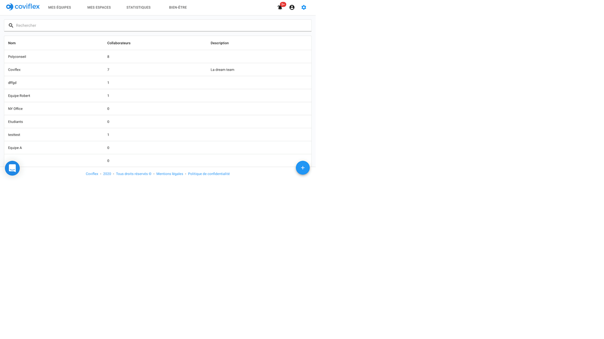

Ajouter une équipe.
=============================================
Espace d’ajout.
********************
Pour créer une équipe, allez dans l’onglet “équipes” de la barre de navigation et cliquez sur le même signe “plus” bleu en bas à droite de l’écran.

Création de l’équipe
****************************************

Une fenêtre pop-up s’ouvre. Renseignez un nom et une description à l'équipe. En appuyant sur le bouton enregistrer, vous pouvez ainsi entrer l'équipe dans la liste d'équipes.

En effectuant la même procédure que le manager/organisateur d’équipe, vous pouvez cliquer sur n’importe quelle équipe de la liste d’équipe et appuyer sur le bouton d’ajout de membres en bas à droite de la vue d’une équipe pour désigner les managers et membres.

