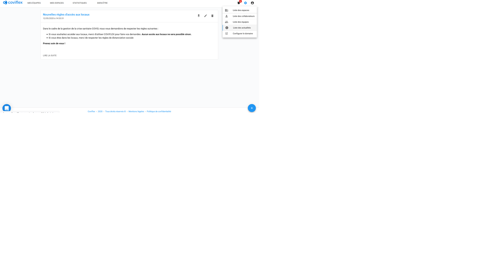
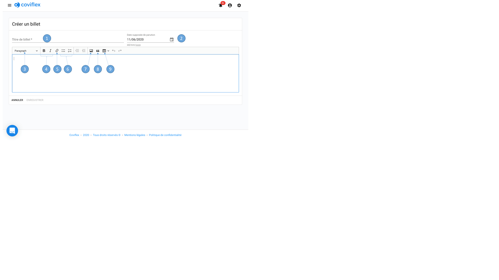
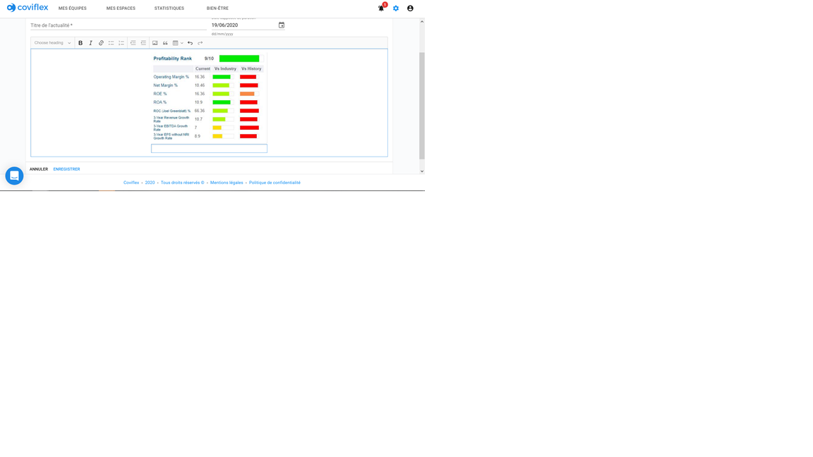
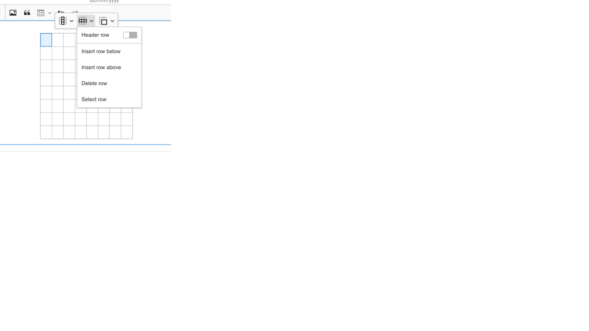

Écrire un billet d’information.
=============================================

L’administrateur peut aussi aller dans la liste des actualités depuis la page principale. Un bouton “plus” bleu en bas à droite permet d’ouvrir une fenêtre de rédaction pour écrire une nouvelle actualité.

La page de rédaction qui s’ouvre permet de:
    1.	Entrer un titre

    2.	Sélectionner une date de publication dans le calendrier

    3.	Choisir un niveau de titre ou paragraphe

    4.	Mettre en forme le texte en gras ou italique

    5.	Ajouter un lien URL

    6.	Etablir une liste à puce ou numérotée

    7.	Importer une image en la sélectionnant dans votre ordinateur ou en la glissant dans la zone de texte

    8.	Mettre en avant une citation

    9.	Insérer un tableau

Une fois une image insérée, une légende et une mise en page peuvent être choisie en cliquant sur l’image:

Une fois un tableau inséré, des options de création/suppression de rangées et colonnes ainsi que de fusion/division des cellules apparaissent en sélectionnant une ou plusieurs cellules :

