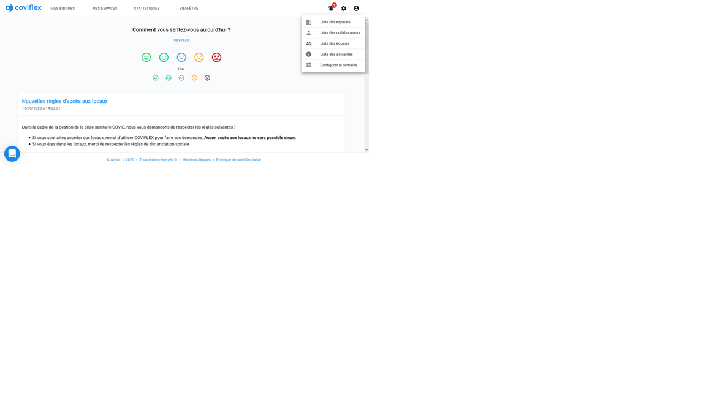
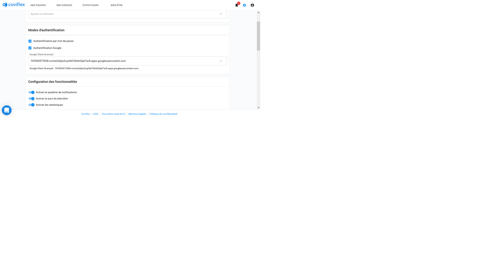
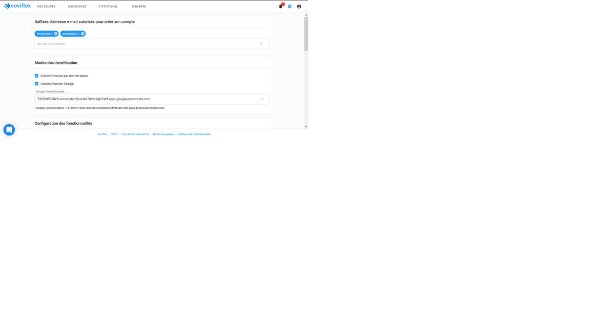
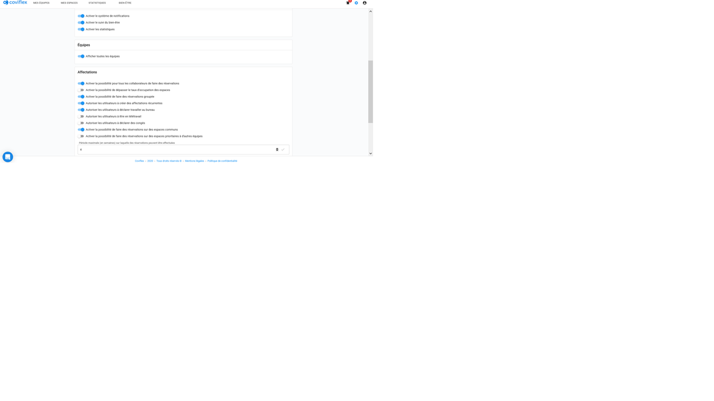
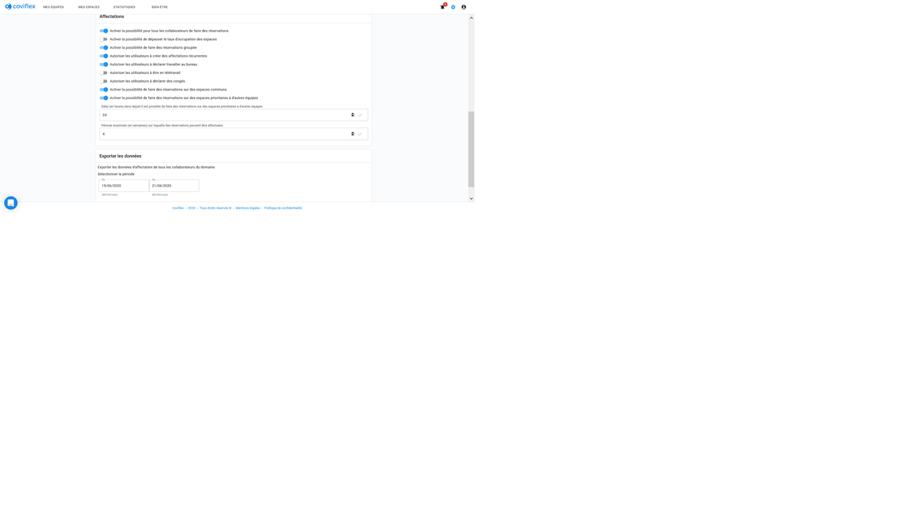
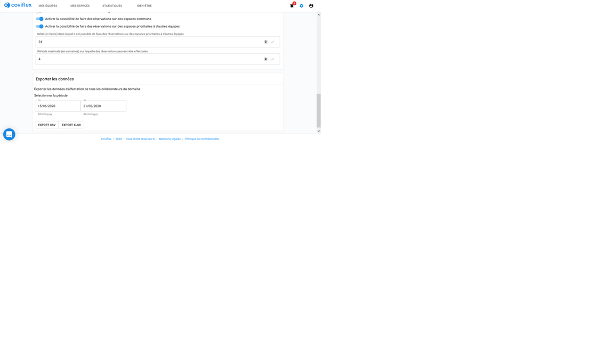
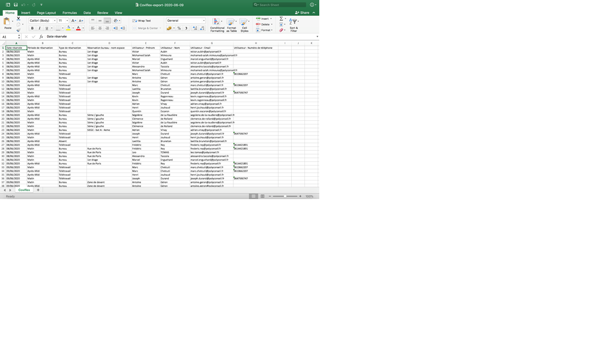

Paramétrer votre domaine
=============================================
Ajouter des suffixes email à autoriser
****************************************

En allant dans la roue des paramétrages de la barre de navigation, vous arrivez sur l’interface de paramétrage de votre domaine :

Dans une zone d’entrée de texte s’affichant en-dessous, vous pouvez entrer les suffixes à ajouter comme étant autorisés dans votre domaine. Pour une addresse email **jean.durand@polyconseil.fr** le suffix à entrer sera donc “polyconseil.fr”.

Une fois entrée, cliquer sur l'icône “+” à droite dans la barre pour que le suffixe soit enregistré comme valide. Celui-ci apparaît alors dans une bulle bleue au-dessus.

Pour désactiver un suffixe, il suffit alors d’appuyer sur la croix à droite du suffixe dans la bulle bleue. La bulle disparaîtra et le suffixe en question ne sera alors plus valide.

Activation des fonctionnalités
****************************************
Plusieurs fonctionnalités seront activables depuis cette même interface de paramétrage :

Nous pouvons voir que les options activables sont:

    ●	L'authentification par mot de passe pour les utilisateurs

    ●	Le système de notification, accessible dans la barre de navigation via la cloche, et qui envoie automatiquement des messages pour signaler

        ○	les réservations effectuées pour vous ou en groupe

        ○	les réservations effectuées sur votre espace

        ○	les changements de statut dans vos demandes d'équipement,

        ○	l’acquisition d’une nouvelle permission (NEWS_EDITOR, SPACE_EDITOR, USER_EDITOR, ADMIN)

        ○	la perte d’une permission

        ○	ajout à une équipe

        ○	nouveau billet

        ○	changement de statut dans une équipe

        ○	demande et réception d'équipement

        ○	suspicion/infection covid

    ●	La rubrique statistiques permettant un suivi du taux d’occupation des locaux

    ●	L’activation d’envoi de QR-codes par email lors d’une réservation avec des informations sur le profil et la réservation afin de vérifier l'accès aux locaux

Paramétrage des réservations
****************************************

Les restrictions et possibilités de réservations sont aussi activables depuis la rubrique Affectation de cette interface.

Exportation des données de réservation
****************************************

En bas de la page de paramétrage, vous pouvez sélectionner une période en cliquant sur un champ d’entrée de date et en indiquant les jours, inclus, délimitant la période sur le calendrier apparaissant dans une fenêtre :

En cliquant sur le bouton d’export au format souhaité (entre CSV et Excel), vous pouvez obtenir toutes les informations sur des réservations effectuées entre ces deux dates :

