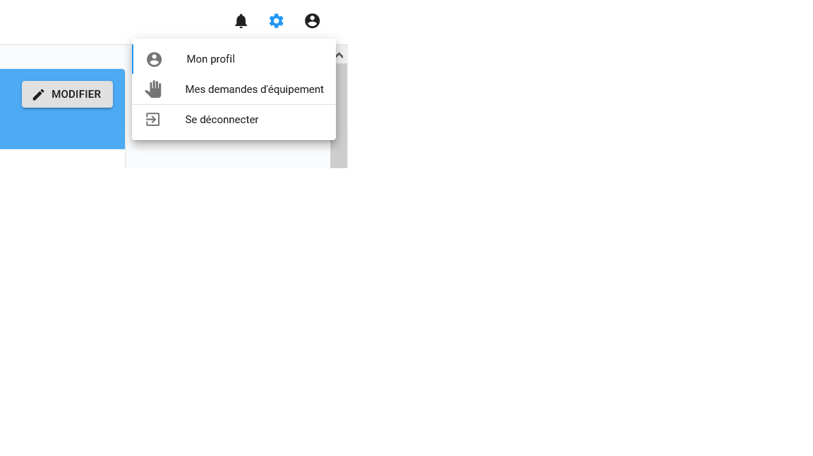
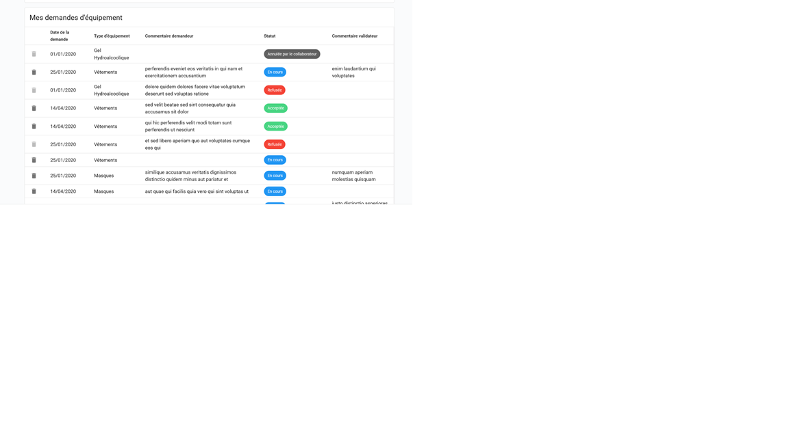
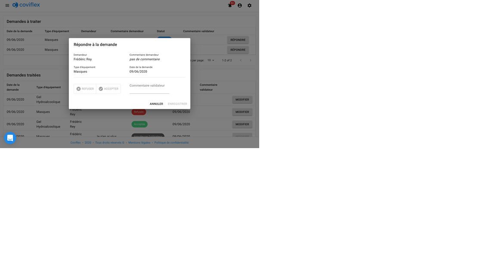

Suivi des demandes d’équipement
=============================================
Valider les demandes d'équipement
***************************************

En allant sur la roue des réglages dans la barre de navigation, vous cliquer sur “Liste des demandes d'équipement” de son menu déroulant :

La fenêtre de suivi des demandes s’ouvre alors avec la liste des demandes en cours et l’historique des demandes passées :

Dans les demandes en cours, vous pouvez cliquer sur le bouton “répondre” à droite de l’une d’entre elle pour ouvrir une fenêtre de validation de la demande. Cette fenêtre contient les informations de la demande (équipement, demandeur, commentaire et date).

Vous n’avez plus qu’à cliquer sur “Accepter” ou “Refuser” et accompagner, si besoin, votre choix d’un commentaire pour le demandeur. La réponse n’est effective qu’une fois le bouton “enregistrer” cliqué.

Modifier sa réponse à une demande d'équipement
******************************************************************************

En allant sur l’historique des demandes d'équipement, vous pouvez cliquer sur le bouton modifier à droite pour ouvrir la fenêtre de réponse. A partir de celle-ci, vous pouvez modifier votre réponse et commentaire validateur.

