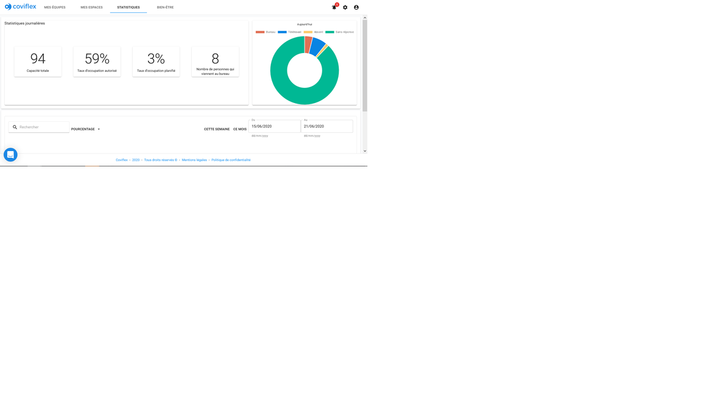
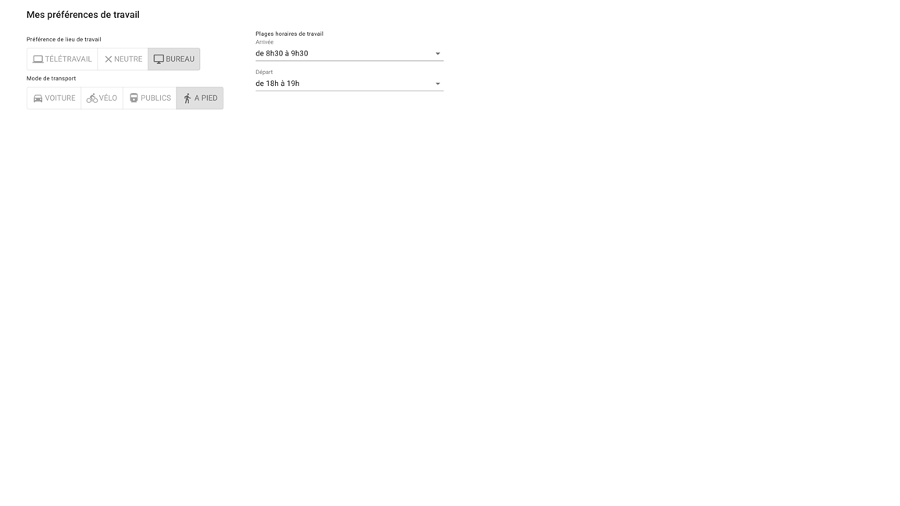
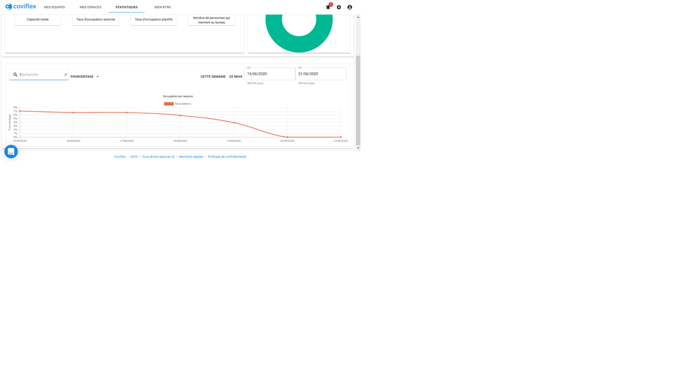
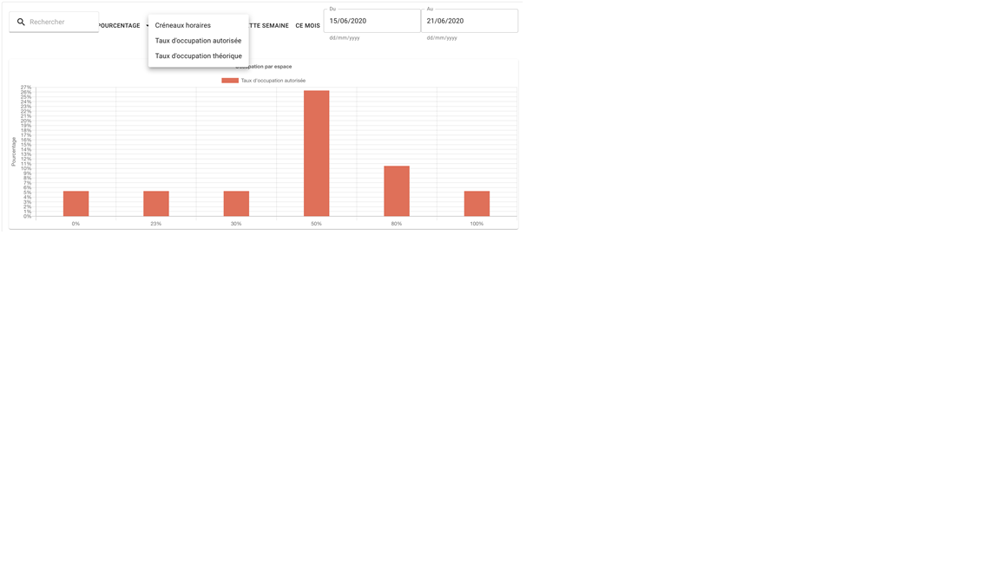

Statistiques
=============================================
Premier panneau
***********************
En allant dans l’onglet statistiques, on a accès à un premier panneau avec les informations sur le taux d’occupation journalier et la répartition des affectations dans le diagramme à droite.

Le taux d’occupation autorisé est le taux d’occupation fixé par les administrateurs et qui est hérité des niveaux parents.

Le taux d’occupation représente le nombre de créneaux horaires réservés dans les locaux sur le nombre de créneaux horaires disponibles, soit le nombre de places disponible multiplié par le nombre de demie journées. Le nombre de créneaux horaires disponibles est affiché à droite ensuite.

Enfin, le nombre de personne préféreraient être au bureau résulte du décompte des préférences de lieu de travail exprimées par les utilisateurs dans leur profil dans cette section :

À droite de ces chiffres clés, un diagramme montre la répartition des affectations assignées et non-assignées pour la journée en cours.

Second panneau
***********************
En allant dans le deuxième panneau, vous pouvez sélectionner une variable en abscisse: soit un nombre de créneaux, soit un taux d’occupation. L’histogramme suivant affiche le nombre d’espaces, ou le pourcentage des espaces, ayant le nombre de créneaux horaires inscrit en abscisse.

On peut changer la valeur de la donnée en abscisse en cliquant sur le bouton “créneaux horaires”. Un menu déroulant défile et permet de sélectionner un “taux d’occupation théorique” ou un “taux d’occupation autorisé”.

Vous pouvez aussi cliquer sur l’une des dates délimitant la période d’analyse pour modifier cette période.